# BGP Routing Lab – Completion Writeup

**Aim:** Configure eBGP between two autonomous systems (AS 100 and AS 200) in Cisco Packet Tracer and verify end-to-end connectivity.

---

## 1. Topology

- **Router0 (R0)** – AS 100, LAN `172.16.1.0/24`
- **Router1 (R1)** – AS 200, LAN `172.16.2.0/24`
- One 2960 switch per router, two PCs per switch
- R0 ↔ R1 connected by a serial link (`203.0.113.0/30`) – the eBGP peering link

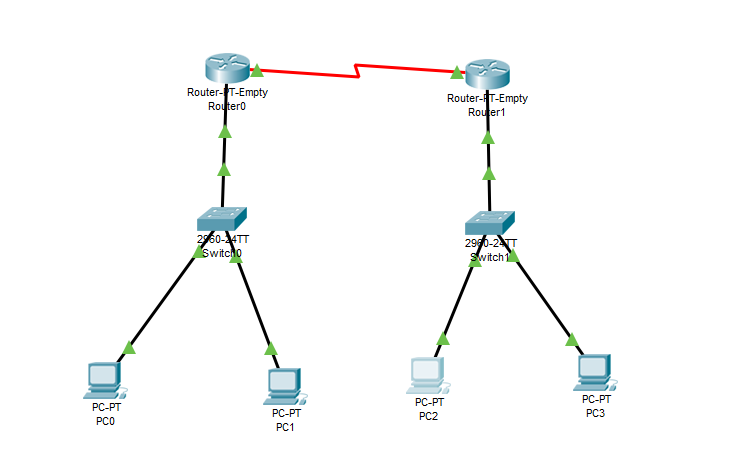

---

## 2. IP Addressing

| Subnet | Devices | Mask |
|---|---|---|
| 172.16.1.0/24 | PC0, PC1, R0 | 255.255.255.0 |
| 172.16.2.0/24 | PC2, PC3, R1 | 255.255.255.0 |
| 203.0.113.0/30 | R0 ↔ R1 (eBGP link) | 255.255.255.252 |

| Device | IP Address | Gateway |
|---|---|---|
| PC0 | 172.16.1.10 | 172.16.1.1 |
| PC1 | 172.16.1.11 | 172.16.1.1 |
| PC2 | 172.16.2.10 | 172.16.2.1 |
| PC3 | 172.16.2.11 | 172.16.2.1 |
| R0 se (link) | 203.0.113.1/30 | – |
| R1 se (link) | 203.0.113.2/30 | – |

### PC0
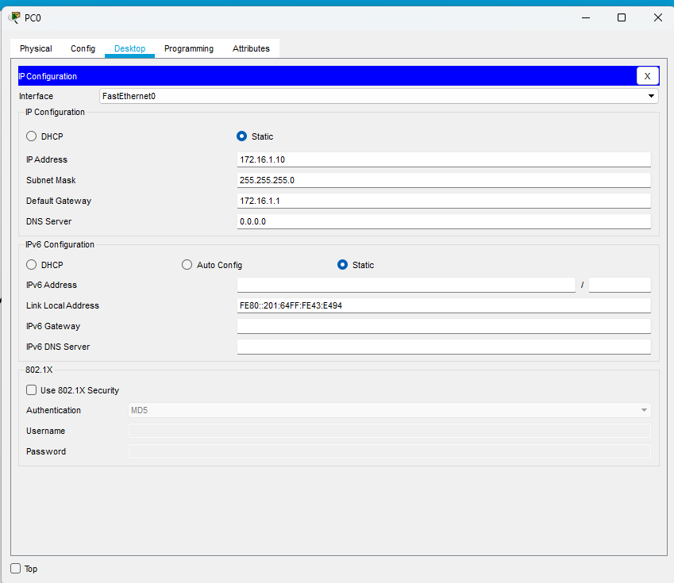

### PC1
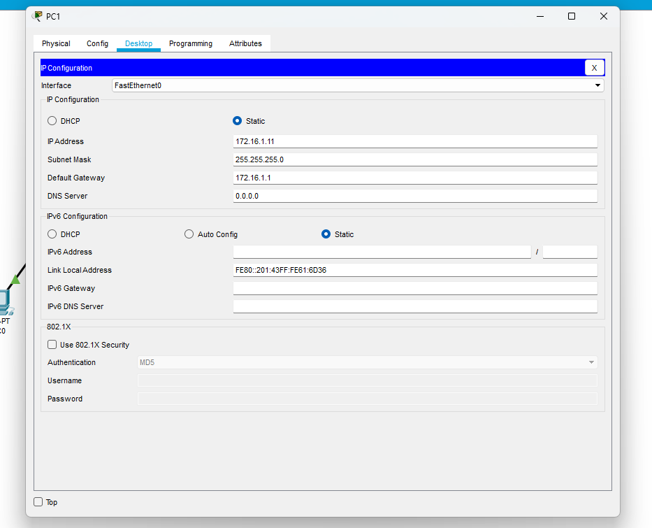

### PC2
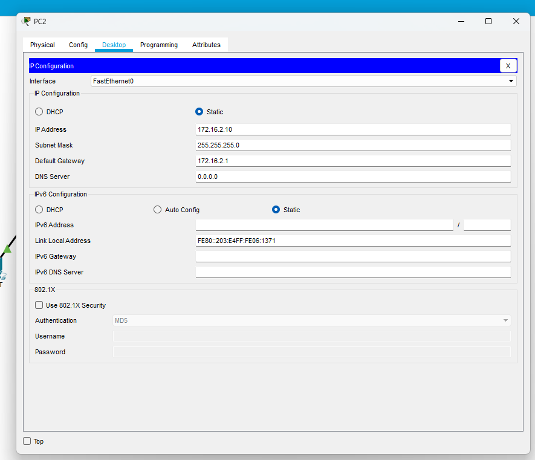

### PC3
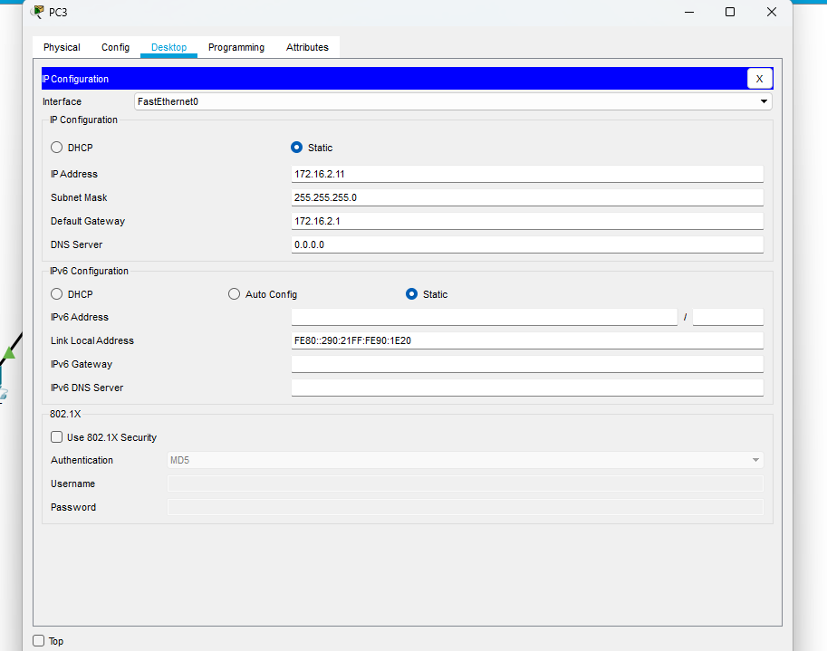

---

## 3. Router Interface Configuration

### R1 (AS 200)

```
enable
configure terminal
hostname R1

interface fastethernet0/0
ip address 172.16.2.1 255.255.255.0
no shutdown
exit

interface serial1/0
ip address 203.0.113.2 255.255.255.252
no shutdown
exit
```

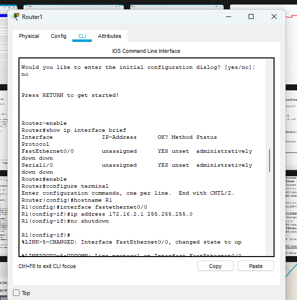

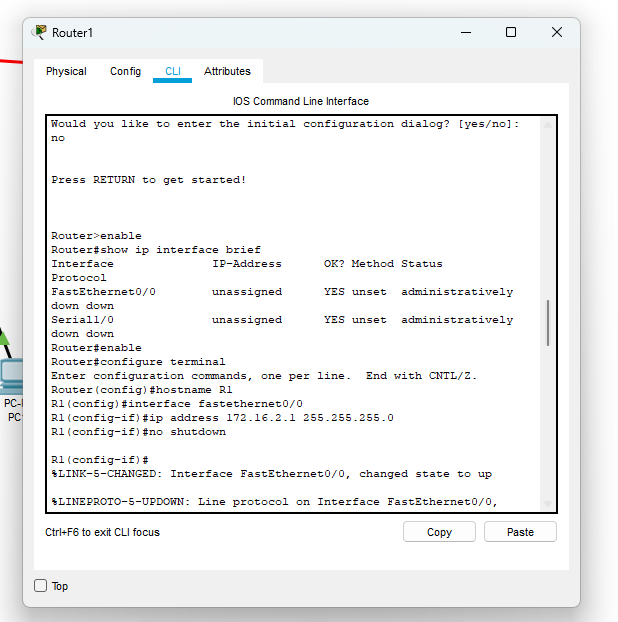

### R0 (AS 100)

```
enable
configure terminal
hostname R0

interface fastethernet0/0
ip address 172.16.1.1 255.255.255.0
no shutdown
exit

interface serial0/0
ip address 203.0.113.1 255.255.255.252
clock rate 64000
no shutdown
exit
```

> Adjust interface names on R0 to match your module slots.

---

## 4. BGP Configuration

### R1 (AS 200)

```
router bgp 200
neighbor 203.0.113.1 remote-as 100
network 172.16.2.0 mask 255.255.255.0
exit
end
write memory
```

The `%BGP-5-ADJCHANGE: neighbor 203.0.113.1 Up` message confirms the peering came up.

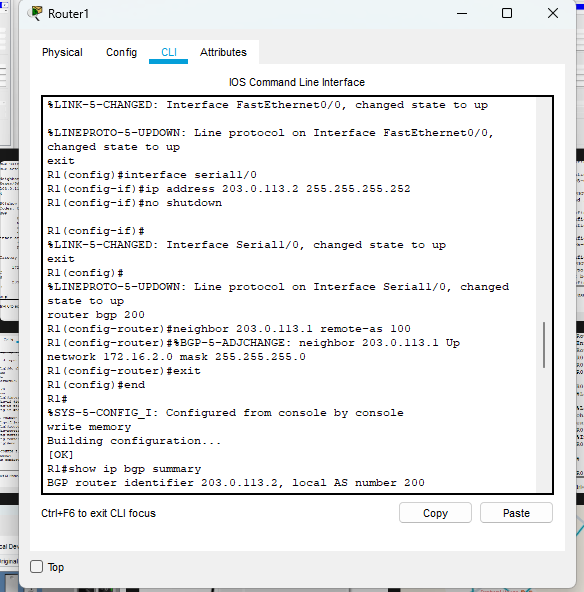

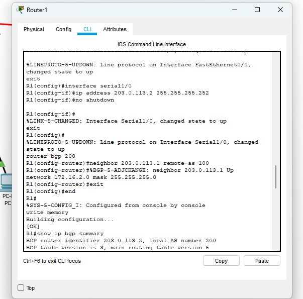

### R0 (AS 100)

```
router bgp 100
neighbor 203.0.113.2 remote-as 200
network 172.16.1.0 mask 255.255.255.0
exit
end
write memory
```

---

## 5. Verification – BGP Neighbor Summary

```
show ip bgp summary
```

- Local AS 200, router ID `203.0.113.2`
- Neighbor `203.0.113.1` in AS `100`, up for ~2 minutes with a numeric `State/PfxRcd` – peering is **Established**

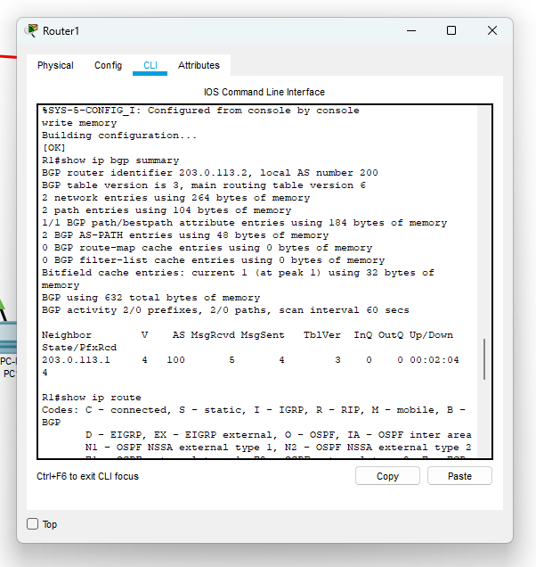

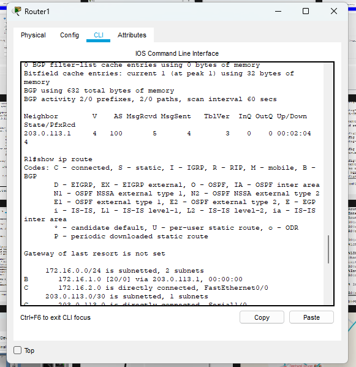

---

## 6. Verification – Routing Table

```
show ip route
```

R1 learned the remote LAN through BGP:

```
B    172.16.1.0 [20/0] via 203.0.113.1
C    172.16.2.0 is directly connected, FastEthernet0/0
C    203.0.113.0/30 is directly connected, Serial1/0
```

`B` = BGP route; administrative distance **20** = eBGP.

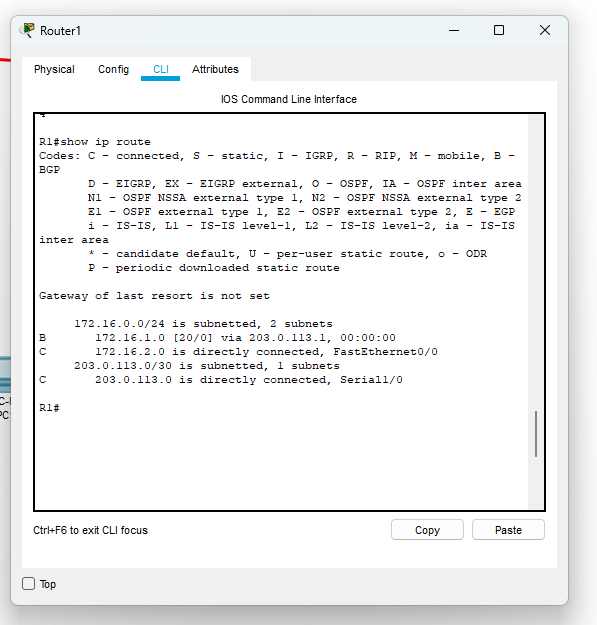

---

## 7. End-to-End Connectivity Test

### PC0 → PC2 (`ping 172.16.2.10`)
First packet timed out (ARP resolution), remaining 3 replied. `TTL=126` shows two router hops.

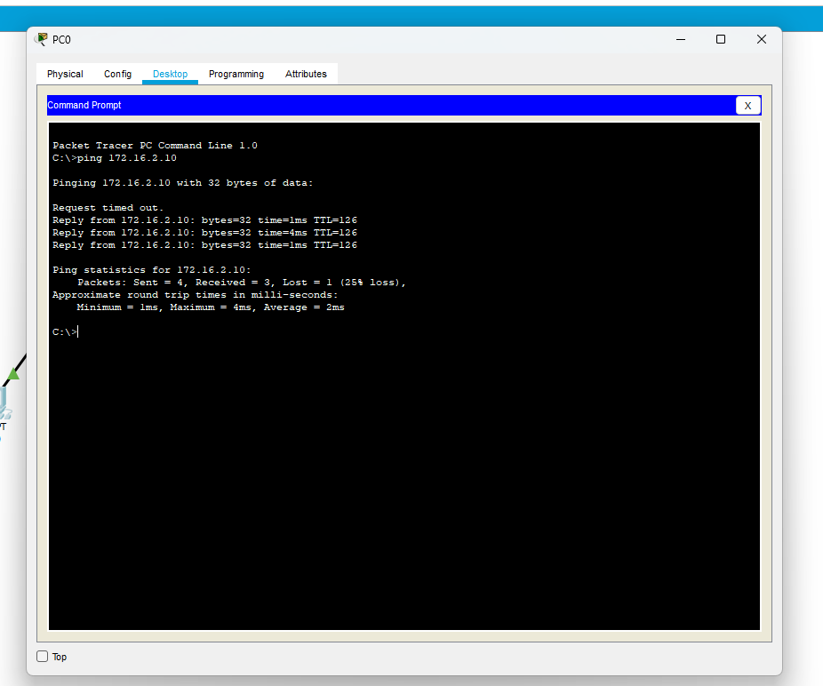

### PC2 → PC0 (`ping 172.16.1.10`)
4/4 replies, 0% loss.

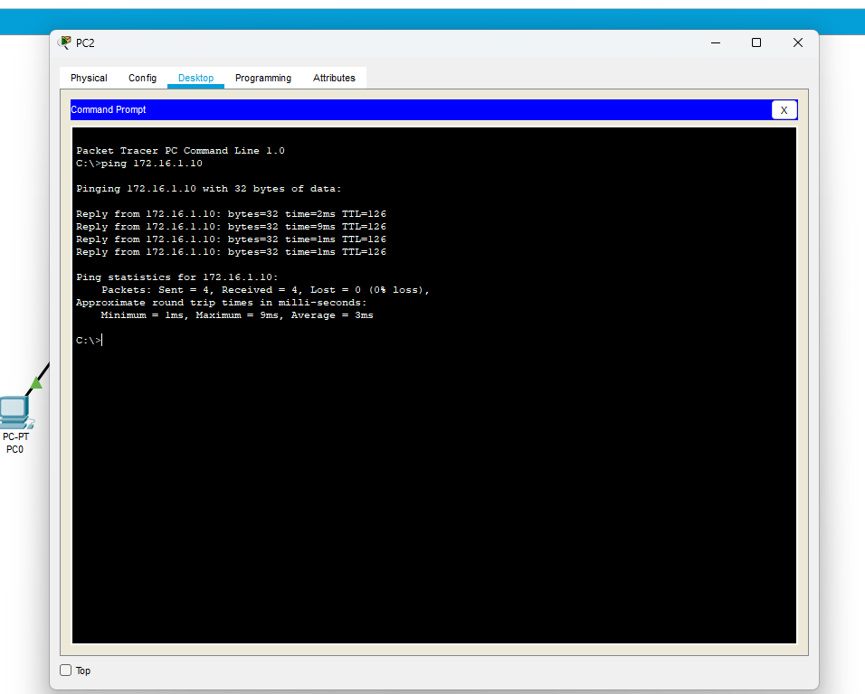

---

## 8. Conclusion

An eBGP peering was established between AS 100 and AS 200. Each router advertised its own LAN using the `network` command, the remote LAN appeared in the routing table as a BGP (`B`) route, and PCs in both autonomous systems could ping each other.
